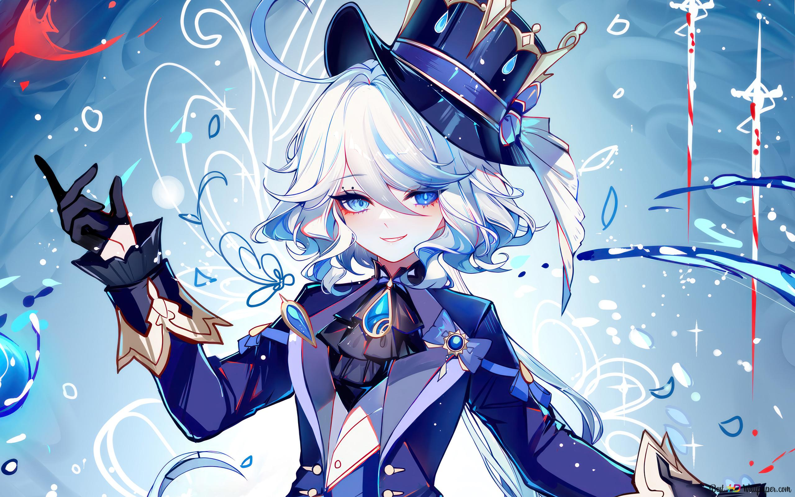
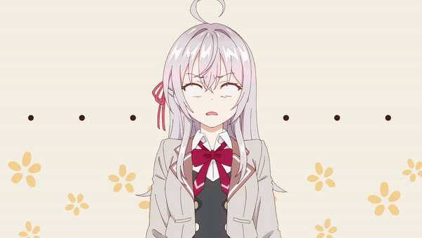
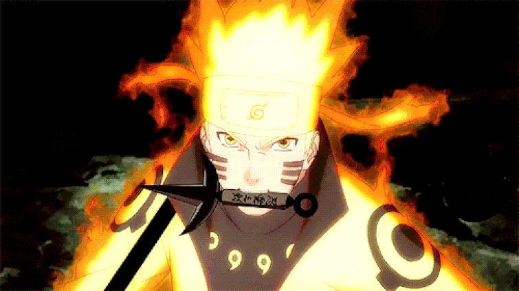

  

## Snow Kitsune

<h1> Howdy, homie. I'm Snowy </h1>

 

<h2> ABOUT ME </h2>

 Yo, wassup? I am a goodfy guy

 

<h2> PROGRAMMING LANGUAGES </h2>

 

 HTML 

 

 CSS 

 

 JAVASCRIPT 

 

 PHP 

 

 PYTHON 

 

  

