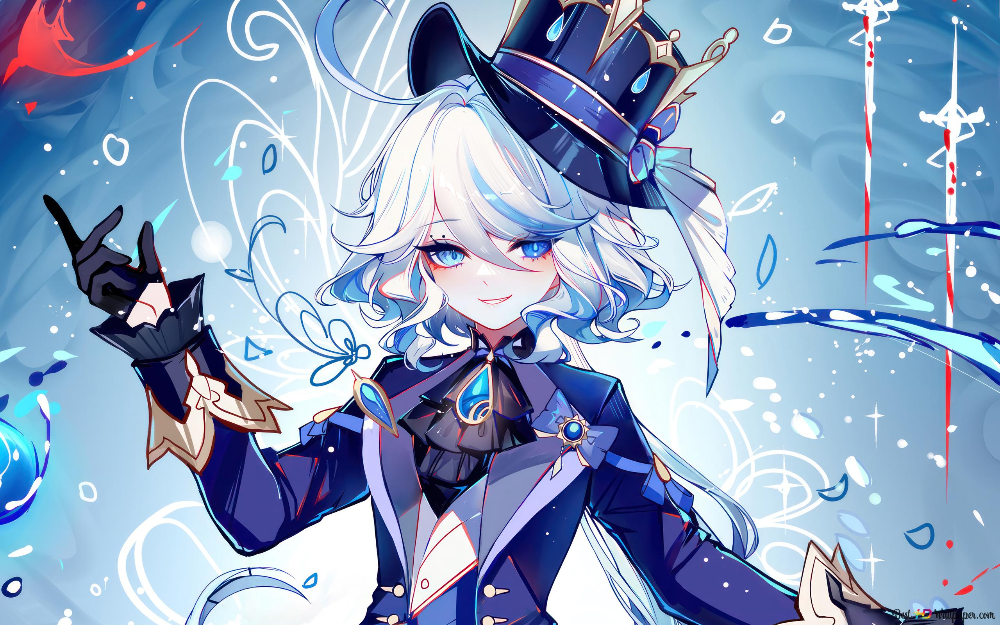

  

<link rel="stylesheet" href="style.css" >

## Snow Kitsune

<h1> Howdy, homie. I'm Snowy </h1>

 

<h2> ABOUT ME </h2>

Brazilian

Amateur Computer Scientist

Linguistic Nerd

Paleontology Nerd

Living in Canada

 

<h2> PROGRAMMING LANGUAGES </h2>

 

 HTML 

 

 CSS 

 

 JAVASCRIPT 

 

 PHP 

 

 PYTHON 

 

<h2> FAVOURITE GAMES </h2>

 GENSHIN IMPACT 

 HONKAI STAR RAIL 

 WUTHERING WAVES 

 DEVIL MAY CRY 5 

 MINECRAFT 

 JURASSIC PARK SURVIVAL 

 FIVE NIGHTS AT FREDDY'S FRANCHISE 

<h2> FAVOURITE MOVIES </h2>

 JURASSIC PARK FRANCHISE 

 JURASSIC WORLD FRANCHISE 

 GODZILLA FRANCHISE 

 HOW TO TRAIN YOUR DRAGON FRANCHISE 

 THE SHAWSHANK REDEMPTION 

<h2> FAVOURITE MANGAS </h2>

<!--                                 

-->

    🌌
     JUJUTSU KAISEN 
    ⛩️

<!--

-->

    💢
     RUSSIA-GO NO ALYA-SAN 
    😳

<!--

-->

    😎
     SOLO LEVELLING 
    🧙

<!--

-->

    🐉
     THE BEGINNING AFTER THE END 
    👑

<!--
 
-->

  

  🥅
  BLUE LOCK
  ⚽

<h2> BEST WAIFUS </h2>

 ALISA MIKHAILOVNA KUJOU 

 FURINA DE FONTAINE 

 FEIXIAO 

 CHIORI 

 SKIRK 

 ZANI 

 JINHSI 

<h1> THANK YOU, AND HAVE A GREAT LIFE 😊</h1>

